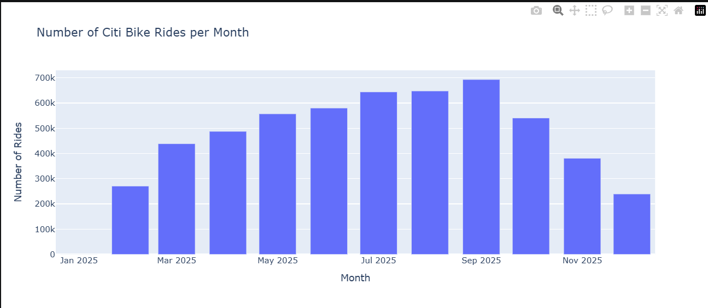
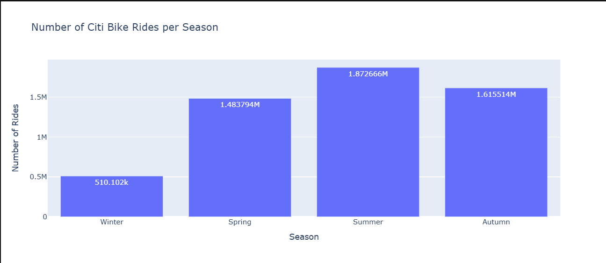

## 1. Citi Bike Jersey City {.smaller}

### From millions of ride events to actionable mobility insights

**Main question:**  
How can Citi Bike trip data be transformed into useful insights about **when, where, and under what conditions people ride?**

<br>

- Citi Bike trip data
- Weather enrichment
- Temporal and station analysis
- Neighborhood-level spatial analysis
- PostgreSQL + PostGIS
- Tableau dashboard

::: {.notes}
Hello everyone. Today I am going to present my Citi Bike Jersey City data analytics project.

I started with raw Citi Bike trip files, but a trip record alone only tells us where and when a ride happened.

I wanted to understand three things: when people ride, where activity is concentrated, and whether external factors such as weather help explain demand.

To answer these questions, I built an end-to-end analytics pipeline using Python, weather data, geospatial analysis, PostgreSQL, PostGIS, and Tableau.
:::

---

## 2. The Analytics Story {.smaller}

A Citi Bike trip tells us when and where a ride happened, the bike type, and whether the rider was a member or casual user.

But raw transactions do not directly explain:

<br>

- How demand changes through the year
- Which stations dominate the network
- How weather relates to ridership
- Which neighborhoods have the highest activity

### Goal: transform individual rides into meaningful mobility patterns.

::: {.notes}
The starting point was transactional Citi Bike data.

It contains timestamps, station names, coordinates, bike type, and membership type.

However, raw transactions are not the same as insight.

Knowing that one ride happened at Grove Street does not tell us whether Grove Street is strategically important.

The challenge was therefore to transform individual trip records into patterns that support interpretation and decision-making.
:::

---

## 3. Data Collection & Raw Structure {.smaller}

Monthly Jersey City Citi Bike ZIP files were downloaded automatically from the Citi Bike S3 repository.

<br>

- Python automated downloading and extraction
- Monthly CSV files were concatenated
- Duplicate `ride_id` values were removed
- The process was extended to **January–June 2026**

The original dataset contains **13 variables**:

| Category | Variables |
|---|---|
| Ride | `ride_id`, `rideable_type` |
| Time | `started_at`, `ended_at` |
| Start | station name/ID, latitude, longitude |
| End | station name/ID, latitude, longitude |
| Rider | `member_casual` |

### 2025 raw data: **952,093 rides × 13 columns**

::: {.notes}
The first stage was automated data acquisition.

Instead of downloading every monthly file manually, Python downloads, extracts, and combines the Citi Bike files.

This makes the process reproducible and allows new months to be added easily.

After combining the 2025 files, the raw dataset contained 952,093 ride records and 13 variables.
:::

---

## 4. Data Quality & Feature Engineering {.smaller}

Missing values were limited and concentrated mainly in destination information.

| Field | Missing | Share |
|---|---:|---:|
| `end_station_id` | 4,265 | 0.448% |
| `end_lat / end_lng` | 3,425 | 0.360% |
| `end_station_name` | 3,128 | 0.329% |
| `start_station_name` | 3 | ~0.0003% |

After duration-related processing:

### **~951,743 working records**

New analytical features:

<br>

- Ride duration
- Date and month
- Day of week
- Hour
- Season

::: {.notes}
Before analysis, I checked data quality.

Missing values were relatively limited and mainly associated with destination information. Start station information was almost complete.

I then calculated ride duration and transformed timestamps into analytical dimensions such as date, month, weekday, hour, and season.

This is where operational data started becoming analytical data.
:::

---

## 5. Weather Enrichment {.smaller}

Historical weather data for Jersey City was collected from **Open-Meteo** around coordinates **40.7178, -74.0431**.

Weather variables:

<br>

- Maximum, minimum, and average temperature
- Precipitation
- Rain
- Snowfall
- Maximum wind speed

Daily ride counts were merged with weather observations using **date**.

### Result: **0 missing values across merged weather variables**

::: {.notes}
After understanding when rides happened, I added environmental context.

Weather data came from Open-Meteo and included temperature, precipitation, rain, snowfall, and wind speed.

Because Citi Bike data is ride-level while weather is daily, I first aggregated rides by date and then joined the daily totals with weather observations.

The resulting weather-analysis table had no missing weather values for the analyzed dates.
:::

---

## 6. Temporal Analysis: Monthly Demand {.smaller}

The analysis shows strong changes in demand throughout the year.

{width=72% fig-align="center"}

### September had the highest activity in the enriched monthly analysis.

::: {.notes}
The first major analytical question was how demand changes over time.

Activity increases strongly from the colder months toward summer and early autumn.

September reached the highest monthly value in the enriched analysis, followed by a decline toward winter.

The important insight is the overall seasonal shape of demand rather than only one individual month.
:::

---

## 7. Seasonality & Weather {.smaller}

### How does weather relate to Citi Bike demand?

{width=72% fig-align="center"}

<br>

- Summer showed the highest activity
- Winter showed the lowest activity
- Temperature provides useful context for changes in daily ridership
- The relationship shows **association, not causality**

::: {.notes}
Grouping the data by season made the pattern even clearer.

Summer had the highest activity and winter had the lowest.

I then compared daily ride volume with temperature, wind speed, and precipitation and created a time-series comparison between rides and average temperature.

This analysis shows associations rather than causality, but weather provides useful context for understanding demand variation.
:::

---

## 8. Station Analysis {.smaller}

### Top Starting Stations

| Station | Departures |
|---|---:|
| **Grove St PATH** | **244,456** |
| Hoboken Terminal | 142,558 |
| Hamilton Park | 122,260 |
| River St & Newark St | 121,027 |
| Newport PATH | 113,275 |
| Exchange Pl | 110,247 |

### Top Ending Stations

| Station | Arrivals |
|---|---:|
| **Grove St PATH** | **259,946** |
| Hoboken Terminal | 146,358 |
| River St & Newark St | 124,079 |
| Hamilton Park | 122,935 |
| Newport PATH | 114,186 |

::: {.notes}
After understanding when people ride, I moved to where they ride.

Grove Street PATH was the strongest station in both directions, with more than 244 thousand departures and approximately 260 thousand arrivals.

Other high-volume locations include Hoboken Terminal, Hamilton Park, Newport PATH, and River Street.

Several of the busiest locations are connected to major transportation hubs.
:::

---

## 9. Spatial Analysis {.smaller}

Station coordinates were converted into geographic points with **GeoPandas** using `EPSG:4326`.

The project identified:

<br>

- **480 stations** in the complete station dataset
- **78 stations** inside Jersey City neighborhood polygons
- **53 neighborhood polygons**

Interactive Folium maps were created for:

<br>

- Station locations
- Total activity
- Station count
- Average activity per station
- Departures and arrivals

::: {.notes}
Coordinates allowed me to move from station names to spatial analysis.

I converted longitude and latitude into geographic points using GeoPandas.

The complete station dataset contained 480 stations, while 78 were located inside the Jersey City neighborhood polygons used in the project.

The GeoJSON contained 53 neighborhood polygons.

Folium was then used to visualize several geographic measures interactively.
:::

---

## 10. Neighborhood Insights {.smaller}

| Neighborhood | Stations | Total Activity |
|---|---:|---:|
| **Van Vorst Park** | 6 | **1,067,669** |
| Palus Hook | 6 | 658,549 |
| Newport | 2 | 434,986 |
| Journal Square | 3 | 356,885 |
| Hamilton Park | 2 | 349,111 |

### Van Vorst Park had the highest total neighborhood activity.

Average activity per station revealed another pattern:

<br>

- **Newport:** ~217,493
- **Van Vorst Park:** ~177,945
- **Hamilton Park:** ~174,556

::: {.notes}
Once stations were assigned to neighborhoods, I aggregated arrivals and departures geographically.

Van Vorst Park had the highest total activity, exceeding one million combined activity records.

However, total activity is affected by station count.

When I calculated average activity per station, Newport ranked particularly high despite having only two stations in this spatial summary.

This demonstrates why total activity and station efficiency should be considered separately.
:::

---

## 11. PostgreSQL & PostGIS {.smaller}

The analytical data was moved into:

### **PostgreSQL 17 + PostGIS 3.4**

Main database objects:

<br>

- `jersey_city`
- `jersey_weather`
- `jersey_city_neighborhoods`
- `jc_2025_stations`

PostGIS validation:

<br>

- Neighborhoods → `ST_Polygon`
- Stations → `ST_Point`
- Coordinate system → **SRID 4326**

::: {.notes}
The next step was to move from exploratory notebooks to a reusable analytics architecture.

Python was connected to PostgreSQL using SQLAlchemy, while PostGIS was enabled for geographic information.

Ride data, weather, neighborhood polygons, and station points were stored as separate database objects.

PostGIS allows geographic objects and spatial logic to be managed directly inside PostgreSQL.
:::

---

## 12. Preparing Data for Tableau {.smaller}

A dashboard-specific materialized view was created:

### `mv_tableau_citibike_dashboard`

It combines:

<br>

- Ride and rider information
- Date and time dimensions
- Ride duration and distance
- Weather
- Start and end neighborhoods
- Temperature groups
- Precipitation indicators

### Purpose: one optimized analytical source for Tableau.

::: {.notes}
I did not want Tableau to repeat all the cleaning, joining, and feature-engineering logic.

For this reason, I created a PostgreSQL materialized view specifically for the dashboard.

Python and SQL prepare the data, while Tableau focuses on visualization and interaction.

This separation creates a cleaner and more maintainable architecture.
:::

---

## 13. Dashboard Data Quality & Performance {.smaller}

The materialized view contained:

### **948,659 rows**

Quality checks:

<br>

- **948,659 / 948,659** had weather information
- **948,659 / 948,659** had calculated distance
- **520,640** had start-neighborhood matches
- **516,527** had end-neighborhood matches

Indexes were added for:

<br>

- `ride_id`
- `ride_date`
- `ride_hour`
- `member_casual`

::: {.notes}
Before connecting the data to Tableau, I validated the materialized view.

It contained 948,659 records, with complete weather and distance information.

Neighborhood coverage was lower because some stations fall outside the Jersey City neighborhood polygons.

I also created indexes for frequently filtered dimensions to improve dashboard performance.
:::

---

## 14. Final Tableau Dashboard {.smaller}

### Explore the Interactive Citi Bike Dashboard

<br><br>

<div style="text-align: center;">

[**Open Interactive Dashboard on Tableau Public**](https://public.tableau.com/app/profile/pertshuhi.papikyan/viz/CitiBikeJerseyCityanalysis/Dashboard1?publish=yes){.btn .btn-primary target="_blank"}

</div>

::: {.notes}
The final stage is the Tableau dashboard.

Instead of presenting every Python chart separately, the dashboard combines high-level KPIs with temporal, geographic, weather, and station-flow analysis.

When presenting it, I follow a clear sequence.

First, how much activity exists. Then when people ride, where they ride, how weather relates to demand, and finally how stations connect through origin-destination flows.
:::

---

## 15. Key Findings {.smaller}

The analysis reveals a connected mobility story.

<br>

- Citi Bike demand shows strong **seasonality**
- Summer activity is substantially higher than winter
- **Grove St PATH** leads both origin and destination rankings
- Activity is concentrated in a relatively small number of neighborhoods
- **Van Vorst Park** leads total neighborhood activity
- **Newport** shows particularly high activity per station
- Weather provides context for daily demand variation
- Transport hubs repeatedly appear among the busiest locations

::: {.notes}
Several patterns stand out across the complete analysis.

Demand is strongly seasonal and geographically concentrated.

Grove Street PATH dominates the station analysis, while Van Vorst Park leads total neighborhood activity.

Newport is interesting because its average activity per station is particularly high.

Weather adds another layer of context to temporal demand patterns.

Together, these findings show why time, geography, and environmental conditions should be analyzed together.
:::

---

## 16. From Insight to Decision {.smaller}

The analysis can support operational decisions such as:

<br>

- Prioritizing high-demand stations
- Supporting bike rebalancing around transport hubs
- Anticipating seasonal demand changes
- Using weather as an additional planning signal
- Identifying neighborhoods with high activity per station
- Comparing arrivals and departures for imbalance
- Monitoring important origin-destination flows

::: {.notes}
The purpose of analytics is not only to describe the past.

These insights can support operational decisions.

High-volume transport hubs may need closer monitoring and rebalancing.

Seasonality can support capacity planning, while weather can provide an additional demand signal.

Neighborhood analysis can also identify locations where a small number of stations carry particularly high activity.
:::

---

## 17. Architecture & Limitations {.smaller}

### End-to-End Pipeline

```text
Citi Bike Files
      ↓
Python Download & Cleaning
      ↓
Weather + GeoJSON Enrichment
      ↓
EDA + Spatial Analysis
      ↓
PostgreSQL + PostGIS
      ↓
Materialized View
      ↓
Tableau Dashboard
```

### Limitations

<br>

- Some destination information is missing
- Not all stations fall inside Jersey City neighborhood polygons
- Weather relationships show **association, not causality**
- Row counts differ across processing stages
- 2026 extension currently covers **January–June**

::: {.notes}
This slide summarizes both the architecture and the main limitations.

The project moves from raw Citi Bike files through Python, weather and geographic enrichment, exploratory analysis, PostgreSQL and PostGIS, and finally Tableau.

Some destination data is missing, and not every station falls inside the Jersey City neighborhood boundaries.

Weather relationships are exploratory and should not be interpreted as proof of causality.

Different processing stages also explain why row counts are not identical throughout the project.
:::

---

## 18. Conclusion {.smaller}

### From raw rides to a complete analytics workflow

The project combines:

<br>

- **Python + Pandas** — acquisition, cleaning, analytics
- **Open-Meteo** — weather enrichment
- **GeoPandas + Folium** — spatial analysis
- **PostgreSQL + PostGIS** — analytical storage
- **SQLAlchemy** — Python/database integration
- **Tableau** — interactive business intelligence

<br>

### Key takeaway

**The value came from connecting time, weather, geography, stations, and rider activity into one analytical story.**

---

### Thank You — Questions?

::: {.notes}
To conclude, this project covers the complete analytics lifecycle.

I collected raw data, cleaned and enriched it, analyzed temporal and geographic patterns, added weather context, created a spatial database architecture, and finally built an interactive Tableau dashboard.

The main lesson is that the strongest insights did not come from one individual chart.

They came from connecting time, weather, geography, stations, and rider activity into one analytical story.

Thank you. I am happy to answer any questions.
:::